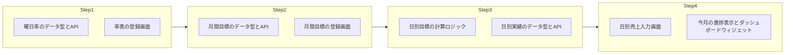

# 売上：手入力＋月間目標＋曜日率表で日別目標を自動計算 — プラン

日々のCSV取り込みは行わず、**日ごとの売上は手入力**。**月間目標**と**曜日ごとの売上率**を登録し、そこから**日別売上目標を自動計算**。実績入力で**進捗・達成率が自動更新**される仕様です。将来的な月次CSV取込も想定したデータ構造にします。

---

## 1. 前提の整理


| 項目      | 方針                                           |
| ------- | -------------------------------------------- |
| 日次の売上   | **手入力**（毎日CSV取り込みはしない）                       |
| 月次CSV取込 | **将来やりたい** → データ形式を「日別実績」に合わせておき、後から取込APIを足す |
| 月間目標    | 店舗・年月ごとに「月間売上目標（円）」を1つ登録                     |
| 曜日別率    | 月〜日の7つに「売上率」（例: 月0.9, 土1.3）を登録。率の合計で按分する     |
| 日別目標    | 月間目標と曜日率から、その月の「日ごとの目標」を自動計算                 |
| 自動計算    | 実績を入力すると、日別達成率・月間累計・月間達成率が自動で更新される           |


---

## 2. データ構造（案）

### 2.1 曜日別売上率（率表）

- **保存**: `data/sales-day-of-week-rates.json` など
- **単位**: 全店共通 または 店舗別（まずは全店共通でよい）
- **形の例**:

```json
[
  { "dayOfWeek": 0, "label": "日", "rate": 1.2 },
  { "dayOfWeek": 1, "label": "月", "rate": 0.9 },
  ...
  { "dayOfWeek": 6, "label": "土", "rate": 1.3 }
]
```

- 未設定の曜日は 1.0 として扱う。

### 2.2 月間売上目標

- **保存**: `data/sales-targets-monthly.json` など
- **形の例**:

```json
[
  { "storeId": "store-a", "yearMonth": "2026-02", "amount": 3000000 },
  { "storeId": "store-b", "yearMonth": "2026-02", "amount": 2500000 }
]
```

### 2.3 日別実績（手入力＋将来CSV取込用）

- **保存**: `data/sales-daily.json` など
- **形の例**:

```json
[
  { "storeId": "store-a", "date": "2026-02-10", "amount": 95000 },
  ...
]
```

- 日付は YYYY-MM-DD。同じ storeId・date が複数ないようにする（上書き更新想定）。
- **将来の月次CSV取込**: 同じ形式にパースしてこの配列にマージするAPIを追加すればよい。

---

## 3. ロジック：日別目標の自動計算

1. **対象**: 店舗 `storeId`、年月 `yearMonth`（例: 2026-02）
2. その月の **全日付** を列挙（1日〜月末）
3. 各日付の **曜日** を取得し、率表から **rate(日)** を取得（0=日, 1=月, …）
4. **月間目標** を取得: `targetMonthly`
5. **按分係数**:
  `totalRate = sum( rate(日) for 日 in その月の全日付 )`  
   **日別目標(日) = targetMonthly × ( rate(日) / totalRate )**
6. 端数は四捨五入または切り捨てで統一

これで「その月のカレンダー」に対して日別目標が一意に決まります。率表や月間目標を変えれば、再計算するだけです。

---

## 4. 「実績入力で自動計算される」の中身

- **入力**: 店舗・日付・売上実績（円）を1件保存
- **自動で行う計算**（表示用）:
  - **日別**: その日の 目標 / 実績 / 達成率（%）
  - **月間**: その月の 目標合計 / 実績合計（入力済み日の合計）/ 達成率（%）
  - **残り**: 月末までの残日数と、残日分の目標合計 → 「あと○円で目標達成」など
- 保存するのは「実績の数値」だけ。目標・達成率は**都度、上記ロジックで計算して表示**する形にすると、率表や月間目標を変えたときに一貫します。

---

## 5. 画面・機能案

### 5.1 マスタ（店長 or 本部）


| 画面     | 内容                                | 権限             |
| ------ | --------------------------------- | -------------- |
| 曜日別売上率 | 月〜日の率を一覧表示・編集（入力は数字で、保存前にバリデーション） | 本部（または店長は自店のみ） |
| 月間売上目標 | 店舗・年月・目標金額の一覧／登録・編集               | 店長（自店）・本部（全店）  |


### 5.2 実績入力（店長 or 担当）


| 画面     | 内容                                               | 権限            |
| ------ | ------------------------------------------------ | ------------- |
| 日別売上入力 | カレンダー or 日付一覧で「日付・実績（円）」を入力・保存。その日その店舗は1件だけ（上書き） | 店長（自店）・本部（全店） |
| 一覧で入力  | 月を選ぶと、その月の日付一覧と入力欄を表示。まとめて入力・保存                  | 同上            |


### 5.3 表示・ダッシュボード


| 表示             | 内容                                | 権限                              |
| -------------- | --------------------------------- | ------------------------------- |
| 今月の進捗          | 月間目標・実績合計・達成率、日別目標 vs 実績の一覧（表）    | 店長（自店）・本部（店舗切替可）                |
| ダッシュボード用ウィジェット | 「今月の売上 目標○円 実績△円（□%）」「本日の目標・実績」など | 店長・本部（社員は「本日の目標・実績」のみ等、ポリシーで制御） |


### 5.4 将来：月次CSV取込

- 月単位で「売上実績CSV」をアップロードする画面を追加
- CSVをパースして `date / storeId / amount` の形にし、`sales-daily` にマージ（同一 storeId・date は上書き or スキップを選択可能に）
- 手入力とCSVの両方が同じ実績テーブルを参照する形にしておく

---

## 6. API案（例）


| 種別   | パス例                                                              | 役割                                 |
| ---- | ---------------------------------------------------------------- | ---------------------------------- |
| 曜日率  | GET/PUT `/api/sales/rates`                                       | 率表の取得・保存                           |
| 月間目標 | GET/POST/PATCH `/api/sales/targets-monthly`                      | 月間目標の一覧・登録・更新                      |
| 日別実績 | GET/POST/PUT `/api/sales/daily`（クエリ: storeId, date or yearMonth） | 実績の取得・登録・更新                        |
| 計算結果 | GET `/api/sales/summary?storeId=&yearMonth=`                     | その月の日別目標・実績・達成率・月間合計を返す（上記ロジックで計算） |


---

## 7. 実装の順序案




1. **Step 1**: 曜日別率のマスタ（保存形式・API・管理画面）
2. **Step 2**: 月間目標のマスタ（同上）
3. **Step 3**: 「月間目標＋曜日率 → 日別目標」の計算ロジックと、日別実績の保存・API
4. **Step 4**: 日別売上入力画面、今月の進捗表示、ダッシュボードへの売上ウィジェット

**月次CSV取込**は、Step 4 のあとで「取込用API＋アップロード画面」を足す形にすると、既存の手入力と共存できます。

---

## 8. 確認したい点

- **曜日率**: 全店共通でよいか、店舗ごとに持つか（例: A店は土曜が強い、B店は平日メインなど）
- **目標の単位**: 月間のみでよいか、週間目標も将来入れるか（まずは月間のみでOKなら、その前提で進められる）
- **実績入力の権限**: 店長は自店のみ、本部は全店、でよいか

このプランで進めてよければ、Step 1 から具体的な保存形式（ファイル名・JSONスキーマ）とAPI仕様を詰めていけます。